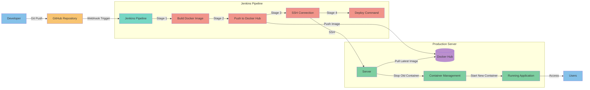

```mermaid
graph LR
    A[Developer] -->|Git Push| B[GitHub Repository]
    B -->|Webhook Trigger| C[Jenkins Pipeline]
    
    subgraph Jenkins Pipeline
        C -->|Stage 1| D[Build Docker Image]
        D -->|Stage 2| E[Push to Docker Hub]
        E -->|Stage 3| F[SSH Connection]
        F -->|Stage 4| G[Deploy Command]
    end
    
    E -->|Push Image| H[(Docker Hub)]
    
    subgraph Production Server
        F -->|SSH| I[Server]
        I -->|Pull Latest Image| H
        I -->|Stop Old Container| J[Container Management]
        J -->|Start New Container| K[Running Application]
    end
    
    K -->|Access| L[Users]
    
    style A fill:#85C1E9
    style B fill:#F8C471
    style C fill:#76D7C4
    style D fill:#F1948A
    style E fill:#F1948A
    style F fill:#F1948A
    style G fill:#F1948A
    style H fill:#BB8FCE
    style I fill:#7DCEA0
    style J fill:#7DCEA0
    style K fill:#7DCEA0
    style L fill:#85C1E9
``` 